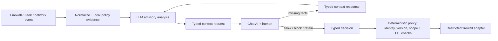

# IntentBridge Network Agent

IntentBridge is the network-side AI service for the hackathon. It accepts normalized network observations, reasons about facts, hypotheses, and missing organizational context, sends a structured question to the future chat agent, receives a structured reply, and applies only a deterministic temporary exact-service network rule.

The model never receives shell or firewall tools. Network changes are validated and executed by restricted application code.

The novel gap it targets is organizational intent: conventional network defenses can identify a dropped flow, and an LLM can explain it, but neither reliably knows whether that exact activity is expected by the business. IntentBridge gathers that missing human context without giving the LLM firewall authority, then makes any approved exception narrow, reversible, attributable, and short-lived.

## What works now

- Firewall drop intake: `POST /events/drop`
- Zeek JSON wrapper intake: `POST /events/zeek`
- Generic/canonical intake: `POST /events/network` or `POST /events`
- OpenAI `gpt-4.1-mini` structured analysis
- Deterministic mock reasoning for offline tests
- SQLite incidents, deduplication, context-request outbox, decisions, rules, and audit timeline
- Pollable chat handoff: `GET /context-requests`
- Missing-fact reply and bounded reanalysis: `POST /context-responses`
- Authorization reply: `POST /decisions`
- Exact temporary allow and block decisions
- In-memory and dry-run iptables adapters
- Linux-only real iptables adapter behind two explicit enable flags
- Automatic TTL revocation and startup reconciliation
- Bounded inference concurrency and fail-closed overload/provider behavior
- Optional inbound integration authentication; mandatory for real iptables mode
- Strict versioned contracts and sample fixtures

No frontend, chat AI, live Zeek reader, or team topology is required to run this component.

## One simple packet walk

1. The firewall teammate posts a drop such as `10.0.2.1 -> 10.0.3.10:443/tcp`, forward from `eth0` to `eth1`, under local rule `BLOCK_VPN_SOURCE`.
2. IntentBridge normalizes it, adds local policy/host evidence, and asks GPT-4.1 mini for typed facts, hypotheses, missing context, and one recommended triage action. Event endpoints currently return HTTP 200 after this synchronous analysis.
3. The chat teammate polls a request resembling:

```json
{
  "incident_id": "inc-...",
  "context_round": 1,
  "question": "Should policy change temporarily for only this exact forward flow?",
  "permitted_grant_scope": {
    "source_ip": "10.0.2.1",
    "destination_ip": "10.0.3.10",
    "destination_port": 443,
    "protocol": "tcp",
    "direction": "forward",
    "interface_in": "eth0",
    "interface_out": "eth1"
  },
  "allowed_responses": [
    "ALLOW_TEMPORARY",
    "KEEP_CURRENT_POLICY",
    "REQUEST_MORE_INFORMATION"
  ]
}
```

4. If facts are missing, the chat AI posts them to `/context-responses`; IntentBridge reanalyzes and can emit round two. If a human authorizes the exact retry, the chat AI posts `ALLOW_TEMPORARY` plus that unchanged scope and a short TTL to `/decisions`.
5. Deterministic code rechecks the current local policy, authenticated identity, request/version freshness, exact scope, and TTL. The in-memory demo then reports `allowed: true`; the expiry worker revokes the rule and returns it to `false` automatically.

## Safety boundary



- The model can recommend `REQUEST_CONTEXT`, `KEEP_BLOCKED`, `ESCALATE`, or `IGNORE_DUPLICATE`.
- It cannot authorize access or emit an executable rule.
- All model text and returned organizational context are explicitly marked untrusted advisory data.
- Chat decisions must echo the request, event, incident, version, and exact service scope.
- An enforceable v1 scope binds IPv4 source, destination, destination port, protocol, forward direction, ingress interface, and egress interface. The observed source port is evidence only because it is normally ephemeral.
- Unknown/default policies, CIDRs, wildcards, changed flows, excessive TTLs, stale/replayed replies, and unauthorized roles fail closed.
- Every applied rule expires.

## Setup on Windows

The repository already uses a project-local `.venv`. To recreate it:

```powershell
python -m venv .venv
.\.venv\Scripts\python.exe -m pip install -e ".[dev]"
```

The project reads `OPENAI_API_KEY` only from this repository's `.env`. It deliberately ignores ambient API keys and other credential stores.

Safe `.env` defaults:

```dotenv
OPENAI_API_KEY=your-project-key
REASONER_MODE=openai
OPENAI_MODEL=gpt-4.1-mini
CHAT_MODE=outbox
FIREWALL_MODE=in_memory
FIREWALL_ENABLED=false
DEMO_MODE=true
```

Never commit `.env`.

## Run

```powershell
.\.venv\Scripts\python.exe -m uvicorn app.main:app --reload
```

Open `http://127.0.0.1:8000/docs` for the generated API interface.

## Local end-to-end demo

In separate PowerShell windows:

```powershell
.\.venv\Scripts\python.exe scripts\send_test_drop.py
.\.venv\Scripts\python.exe scripts\send_test_context.py
.\.venv\Scripts\python.exe scripts\send_test_decision.py --decision allow --ttl 15
```

The first command returns the model's hypotheses and a context request. The optional second command demonstrates a missing-information answer, reanalysis, and a correlated round-two request. The final command sends a distinct authorization decision. Query the exact simulated flow:

```powershell
Invoke-RestMethod -Method Post `
  -Uri http://127.0.0.1:8000/demo/check-flow `
  -ContentType application/json `
  -Body '{"source_ip":"10.0.2.1","destination_ip":"10.0.3.10","destination_port":443,"protocol":"tcp","direction":"forward","interface_in":"eth0","interface_out":"eth1"}'
```

It reports allowed during the TTL and blocked after automatic revocation.

Send Zeek-shaped data:

```powershell
.\.venv\Scripts\python.exe scripts\send_test_zeek.py
```

Run only the real-model structured-output smoke test:

```powershell
.\.venv\Scripts\python.exe scripts\smoke_reasoner.py
```

The script prints model output and token metadata, never the key.

## Chat-agent integration contract

Until the chat service exists, it can poll:

```text
GET /context-requests?status=PENDING
```

Each request contains:

- the normalized observed event
- the matched network policy
- facts, hypotheses, and explicit missing context
- one focused human question
- exact permitted scope when enough flow evidence exists
- allowed response enums and maximum TTL

The chat agent uses two deliberately separate replies:

- `POST /context-responses` with `chat-context-response-v1` supplies missing facts. Those facts are stored as untrusted advisory evidence and trigger bounded reanalysis; they never authorize a rule.
- `POST /decisions` with `decision-v1` supplies an allow, block, or retain-policy decision. Only this path can reach deterministic enforcement.

See `fixtures/chat_context_response_vpn_https.json`, `fixtures/allow_vpn_https.json`, `fixtures/block_temporary.json`, and `fixtures/deny_vpn_https.json`.

When the teammate's chat HTTP endpoint exists, set:

```dotenv
CHAT_MODE=http
CHAT_AGENT_URL=http://chat-agent:8001/context-requests
CHAT_AGENT_TOKEN=replace-with-team-shared-token
```

Every context request remains durable in SQLite even if HTTP delivery fails.

For team integration, configure distinct `NETWORK_INGEST_TOKEN` and `CHAT_INTEGRATION_TOKEN` values. Network event routes accept only the first; context, decision, incident, and demo routes accept only the second. Calls may use either `Authorization: Bearer <token>` or `X-IntentBridge-Token: <token>`. The server derives the trusted chat-agent identity and role from its own `.env`; it does not trust the request body's claimed approver. Without tokens, integration access is loopback-only. `INTEGRATION_API_TOKEN` remains a single-token convenience only for the local in-memory demo.

## Network integration contract

The network teammate can post one of the checked-in contracts:

- `contracts/drop-event-v1.schema.json`
- `contracts/zeek-event-v1.schema.json`
- `contracts/generic-network-event-v1.schema.json`
- `contracts/network-event-v1.schema.json`

Zeek records are wrapped so their flexible fields stay bounded and untrusted:

```json
{
  "schema_version": "zeek-event-v1",
  "log_type": "conn",
  "record": {
    "ts": 1784394060.125,
    "uid": "CxDemo001",
    "id.orig_h": "10.0.2.1",
    "id.orig_p": 51842,
    "id.resp_h": "10.0.3.10",
    "id.resp_p": 443,
    "proto": "tcp"
  }
}
```

## Firewall integration

Development modes:

```dotenv
FIREWALL_MODE=in_memory
# or
FIREWALL_MODE=dry_run_iptables
```

The real adapter is Linux-only and is intentionally hard to enable:

```dotenv
FIREWALL_MODE=iptables
FIREWALL_ENABLED=true
ALLOW_HOST_FIREWALL=true
DEMO_MODE=false
NETWORK_INGEST_TOKEN=a-long-random-network-source-secret
CHAT_INTEGRATION_TOKEN=a-different-long-chat-agent-secret
```

Use it only inside the isolated team topology. Real installs require interface-bound IPv4 forward flows. The network teammate must create `CONTEXT_BLOCK` and `CONTEXT_ALLOW`, with block precedence, before connecting them to the forwarding path. A read-only startup/pre-install verifier requires one unconditional jump to each chain and requires the block jump before the allow jump and every direct `ACCEPT`. IntentBridge never creates, flushes, or rewrites unrelated chains. Startup reconciliation rejects malformed, widened, duplicated, mismatched, or untracked managed rules and retries uncertain cleanup.

## Tests

```powershell
.\.venv\Scripts\python.exe -m pytest -q
.\.venv\Scripts\ruff.exe check app tests scripts
```

The 63-test suite covers event normalization, a 100-event deduplication burst, Zeek intake, iterative context, incomplete evidence, prompt injection, exact/interface-bound approval, mismatch/CIDR/TTL/role rejection, policy retention, adapter semantics, orphan/duplicate detection, expiry, structured OpenAI parsing, separated integration authentication, backpressure failure behavior, and project-only credential loading.

## Important files

- `app/main.py` - FastAPI composition and endpoints
- `app/services.py` - incident, decision, enforcement, and expiry workflow
- `app/reasoners/` - mock and OpenAI analysis implementations
- `app/firewall/` - restricted firewall adapters
- `app/schemas.py` - strict external and internal contracts
- `app/normalizers.py` - firewall/generic/Zeek normalization
- `contracts/` - JSON schemas for teammates
- `fixtures/` - valid and malicious examples
- `NETWORK_AGENT_BUILD_SPEC.md` - full architecture and build rationale
